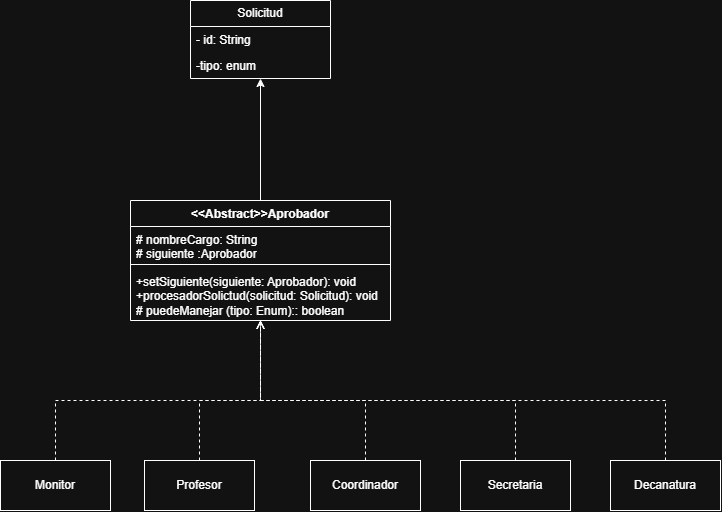

## Diagrama Chain of Responsibility

Este es el diagrama que representa el patrón:

Resumen de Diagrama:
El estudiante no necesita conocer a que entidad enviar la solicitud, simplemente con enviar la solicitud a una entidad de mayor jerarquia.
es posible agregar mas entidades sin afectar el código a las solicitudes.
Por otro lado, si no se puede solucionar la solicitud, esta pasará hasta la ultima entidad y devolverá el mensaje de que ninguna entidad puede solucionar esa solicitud
